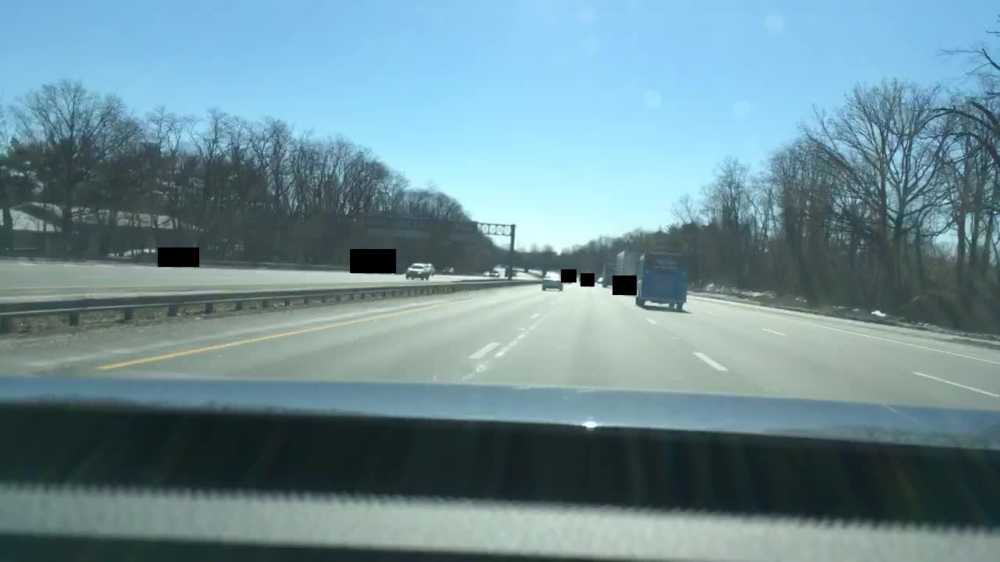

# Idea

When the target domain differs from the source domain, a distillation method can be utilized. A notable implementation is the AutoDistill library ([AutoDistill repo](https://github.com/autodistill/autodistill)). Assuming a confidence threshold of 0.5, bounding boxes (bbox) with confidence below 0.5 are removed from the annotation. However, if the object actually exists, it remains in the image. This mismatch can cause problems.

#### Using Surgical Cutout Augmentation

What happens if, when removing a bbox from the annotation, we set the bbox region to [0,0,0] pixels, similar to cutout augmentation?

I use the BDD dataset for testing, focusing only on daytime images and the classes ["person", "car"]. I randomly sample 9,000 images from the BDD training split for training and evaluation. All daytime images from the test split are used to measure performance.

# Test

I compared three cases:

1. **Default Model**: Use a COCO pre-trained model without fine-tuning on the target dataset.

2. **Control Model**: Generate target dataset labels with the COCO pre-trained model, then fine-tune it.

3. **Experiment Model**: Generate target dataset labels with the COCO pre-trained model. Then, apply the cutout method to lower threshold bounding boxes and remove them from the annotation.

# Results

|                      |   default |   control |   experiment |
|:---------------------|----------:|----------:|-------------:|
| metrics/precision(B) |  0.360822 |  0.741831 |     0.818833 |
| metrics/recall(B)    |  0.264414 |  0.578586 |     0.535742 |
| metrics/mAP50(B)     |  0.295309 |  0.628245 |     0.667828 |
| metrics/mAP50-95(B)  |  0.149616 |  0.355578 |     0.4284   |
| fitness              |  0.164186 |  0.382844 |     0.452343 |

# How to Make BDD100K Dataset Using FiftyOne

For more information about the BDD100K dataset, see the [official documentation](https://docs.voxel51.com/user_guide/dataset_zoo/datasets.html?highlight=bdd100k#dataset-zoo-bdd100k).

For more about model distillation, visit the [AutoDistill repo](https://github.com/autodistill/autodistill). To learn more about cutout augmentation, see the [Surgical Cutout Augmentation Example](reports/568edf27-56604a8c.jpg).

